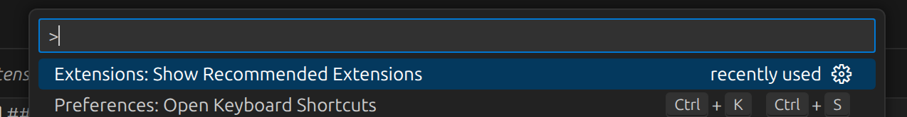
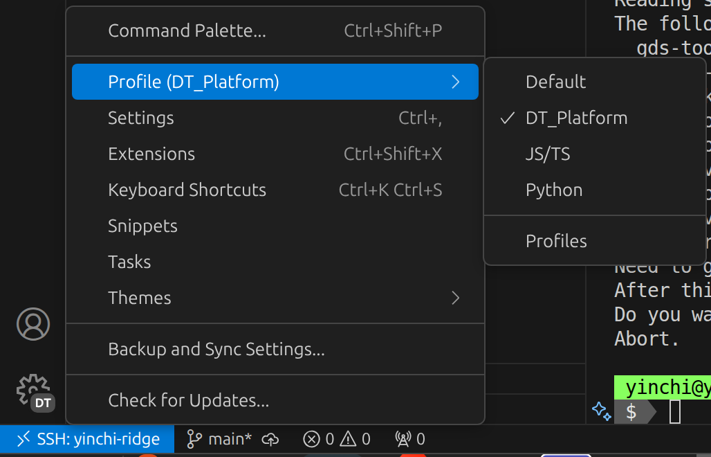

# Hospital Digital Twin platform

This repo contains a demonstrative digital twin platform for hospitals.

The end goal of this project is deployment on [Google Cloud Platform](https://console.cloud.google.com/)&mdash;however, this project is currently still in the local development stage (local Docker Compose stack only).  The roadmap is as follows:

1. [ ] Minimum implementation in Docker
2. [ ] Migration to Kubernetes
3. [ ] Migration to Google Cloud Platform

Additional services to be added to the platform may follow the above pipeline at their own speed.

## Getting started

We assume an apt-based Linux environment.  For Windows machines, use [WSL](https://learn.microsoft.com/en-us/windows/wsl/install) (not tested).

> [!WARNING]
> Do not run VS Code as a snap; this will mess with environment variables and cause some scripts to fail.  See [instructions for installing VS Code via `apt`](https://code.visualstudio.com/docs/setup/linux#_install-vs-code-on-linux).
>
> This is because a terminal session using VS Code's built-in terminal will have `$XDG_DATA_HOME` set.

### init.sh

`init.sh` ensures that you have the minimal tools required for development:

- Visual Studio Code
- `pre-commit`: For setting up pre-commit hooks.
    - This will ensure proper code formatting and style and minimize superfluous formatting-only file changes.
- Go: for Go language development, or simply installing Go-based tools using `go install`.
- `uv`: for Python virtual environment setup and installing Python-based tools using `uv tool install`.
- `npm`: for Typescript development and running Node.js based tools with `npx`.
- Various linters, formatters, etc. using the above tools.

Additional software can be installed using `git script install` (source `scripts.sh` first).

### VS Code extensions

See `.vscode/extensions.json` for a list of recommended extensions.  You can also view a list of recommended extensions using
the command palette (`F1`):

> [!NOTE]
> Note the following:
>
> - VS Code may also make its own extension recommendations.
> - You will need a **lot** of extensions for this monorepo to cover all aspects (container management, Markdown documentation, Python and JS/TS development, etc.).  It is best to create a new VS Code profile specifically for this project.
>
> 

## Full developer documentation

See the `dev-docs/` directory.  The `uv run mkdocs serve` option is an easy way to serve the documentation files locally, with **live refresh**.
