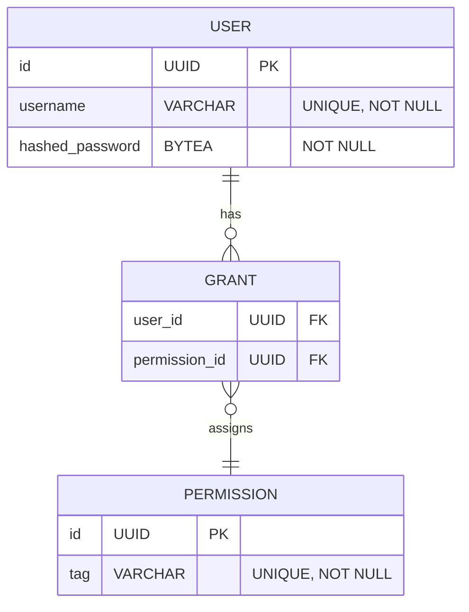

# Authentication

(🚧 **Work in progress**: many of the features described here are not yet implemented.)

Web pages and API calls in the DT platform should be protected using the [ForwardAuth](https://doc.traefik.io/traefik/middlewares/http/forwardauth/) Traefik middleware:


The URL for authentication is `/validate`.  This endpoint operates as follows:

- Expected input is a cookie containing the key `access_token` with a [JWT string](https://www.jwt.io/) as its value.
- If the JWT is valid, the endpoint returns the decoded payload with a **HTTP 200 OK** status.  This 200 status is what instructs the ForwardAuth middleware to proceed with the original request.
- If any status code not in the `2xx` range is returned, it is forwarded to the requester and the original request blocked.

!!! note

    If the user is not logged in, then they have no `access_token` in their Cookies, and we should return **HTTP 303 See Other** selectively based on whether they are fetching a webpage or calling an API endpoint.  This can be checked using the `X-Forwarded-` headers added by the ForwardAuth middleware.

    Calls to API endpoints should **always** return HTTP 401 if unauthorized.

## Security

### Cookie settings

We should test whether authentication still works when `access_token` is set to `HttpOnly` and `Secure`.  This will prevent the cookie being accessed or modified via Javascript, but it will still be sent by the browser on `fetch()` calls.

### Authenticate at middleware, authorize at endpoint

The ForwardAuth middleware can attach the decoded payload using the `authResponseHeaders` setting:

```yaml
http:
  middlewares:
    authMiddleware:
      forwardAuth:
        address: "https://example.com/validate"
        trustForwardHeader: true
        authResponseHeaders:
          - "X-User-ID"
```

This configuration above will provide `X-Forwarded-Method` and `X-Forwarded-Uri` to the authentication service, which will authenticate the user and inject `X-User-ID` into the original request's headers.  This will allow the API endpoint to handle authorization only, while trusting that the user's identity has already been verified.

### Logouts and token revocation

If a user logs out, or otherwise loses access to the DT platform, we need a way to revoke their access token.  To do this, we use a Redis store to keep track of valid user sessions, and add a step to the `/validate` endpoint to check whether the current user has a valid session.  A `/logout` endpoint should be provided to allow a user to remove **themselves** from the list of valid sessions.

## Database schema

To allow for fine-grained permissions, we shall use the following database schema:



Each user is granted some number of permissions, e.g. `service1:user` or `service2:admin`.  To ensure quick lookup, `user.username` and `permission.tag` are indexed.

!!! note

    Services may use their own databases for grants lookup, but a centralized database may be more convienient.

## Docker containers

We use the following Docker images for the authentication service:

- `auth`: FastAPI server; provides
    - `\token` for obtaining a JWT
    - `\validate` for validating a JWT (used by the ForwardAuth middleware)
    - `\logout` for invalidating a JWT when the user logs out (remove from Redis store)
- `auth-postgres`: the database backing the authentication service.
- `auth-redis`: stores valid user sessions, allowing for logouts and revocations.
- `login`: Frontend login page.
