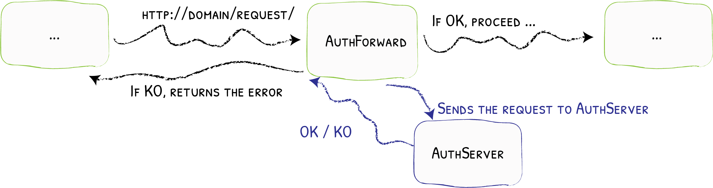

# Architecture: Overview

We use a microservice-based architecture, with [Traefik](https://doc.traefik.io/traefik/) as a reverse proxy.  Services are built using Docker containers, with each service consisting of one or more containers.  In particular, the **authentication** service controls access to each of the other services, using Traefik's middleware architecture, specifically the [ForwardAuth](https://doc.traefik.io/traefik/middlewares/http/forwardauth/) middleware.



The deployment roadmap is as follows:

- [ ] Docker Compose-based deployment
- [ ] Local Kubernetes-based deployment
- [ ] Deployment on Google Cloud Platform

## Docker-based architecture

We use Docker Compose to define our containers, with labels to define Traefik routing.  For example, the specification for these documentation pages are as follows:

```yaml
services:

  # Miniature file server for static files
  # Server doesn't handle base paths, so we mount the files at /public/dev-docs
  # and keep the path prefix (no stripping)
  dev-docs:
    image: europe-west2-docker.pkg.dev/cambridge-ifm/dt-demo-gcp/dev-docs:latest
    restart: always
    profiles:
    - default # Launch service if no profile is specified
    - docs    # Part of documentation service group
    labels:
    - "traefik.enable=true"
    - "traefik.http.routers.dev-docs.rule=PathPrefix(`/dev-docs`)"
```

Note that the image tag corresponds to deployment on [Google's artifact registry](https://cloud.google.com/artifact-registry/docs); other registries include [Docker Hub](https://hub.docker.com/) and the [GitHub Container Registry](https://docs.github.com/en/packages/working-with-a-github-packages-registry/working-with-the-container-registry).  For now, we will only work with **locally-built** Docker images.

### Docker Compose profiles

Sets of related Docker services can be grouped under a single **profile**, corresponding to a single service on the digital twin (DT) platform.  For example, the authentication DT platform service requires the following Docker services:

- `auth`: Server side authentication, provides the `/token` and `/validate` API endpoints.
- `auth-postgres`: Database containing authentication details for each user.
- `auth-redis`: In-memory store for tracking current user sessions; allows handling of logouts and access token revocation (for example, banning a user).
- `login`: React-based login page.

By associating all four of these Docker services with the `auth` profile, they can all be started or stopped in tandem with `docker compose --profile auth up -d` or `docker compose --profile auth down`.  For more on Docker Compose profiles, see the [official Docker documentation](https://docs.docker.com/compose/how-tos/profiles/).

### Traefik configuration

In addition to individual container configuration [using Docker labels](https://doc.traefik.io/traefik/routing/providers/docker/), Traefik also uses a static configuration file, which we mount from `./traefik/traefik.yml`.  Here, we enable the dashboard (mapped to port 10000 in our `compose.yml` file), and ensure that only containers labelled with `traefik.enable=true` are exposed via Traefik.

## Kubernetes-based architecture

(🚧 **TODO**)

Migrating from Docker to Kubernetes requires migrating Traefik from using a Docker provider to a Gateway API provider, with [instructions provided here](https://doc.traefik.io/traefik/routing/providers/kubernetes-gateway/).  The key Kubernetes object controlling routing using the Gateway API is `HTTPRoute`, although experimental [TCP routing](https://doc.traefik.io/traefik/routing/providers/kubernetes-gateway/#tcp) is also available.

An alternative to the Gateway API is to use Traefik's own [Custom Resource Definitions](https://doc.traefik.io/traefik/routing/providers/kubernetes-crd/).

To organize K8s resources into DT platform services, we will use [Helm charts](https://helm.sh/), which themselves can contain [subcharts](https://helm.sh/docs/chart_template_guide/subcharts_and_globals/#creating-a-subchart), thus creating a hierarchy of service groups and individual services.

## Google Cloud platform (GCP)

(🚧 **TODO**)

We will use:

- [Google Kubernetes Engine](https://cloud.google.com/kubernetes-engine?hl=en) (GKE) for service deployment
- [Cloud SQL](https://cloud.google.com/sql?hl=en) for databases
- [Filestore](https://cloud.google.com/filestore/docs/filestore-for-gke) to provide PersistentVolumes for GKE

The project ID in GCP is `dt-demo-hospital`.
