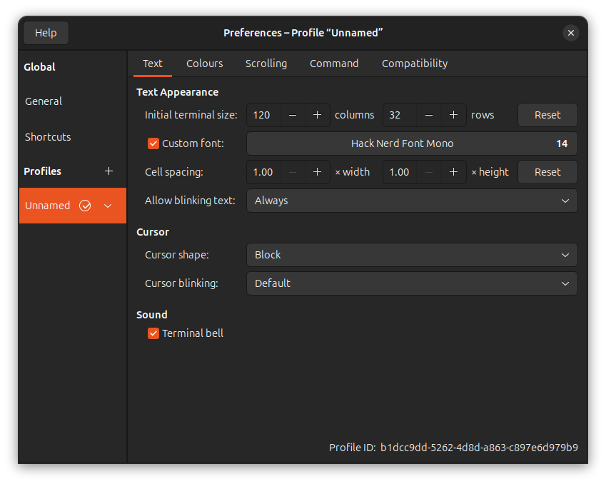
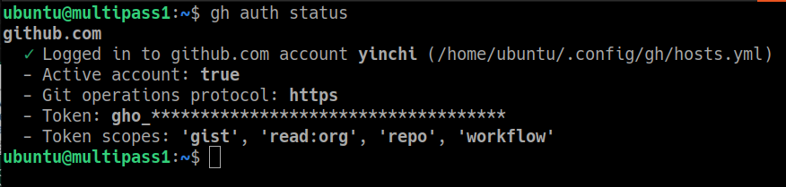

# Hospital DT Demo &ndash; Developer documentation

&copy; 2025 Anandarup Mukherjee & Yin-Chi Chan, Institute for Manufacturing, University of Cambridge

This project contains a demonstrative digital twin platform for a hospital.

## Getting started

This project assumes you have `apt` and `bash`.  Options include:

- [Ubuntu](https://ubuntu.com/tutorials/install-ubuntu-desktop#1-overview)
- [WSL (for Windows users)](https://learn.microsoft.com/en-us/windows/wsl/install). Recommended for Windows users due to automatic port-forwarding between the host and Linux virtual machine.
- A non-WSL virtual machine.  Should only be used as a last resort; you will need to figure out networking/port forwarding yourself.

### Optional: pureline setup

Pureline offers prettified shell prompts with display segments for Git/SSH/etc.  Copy an example pureline configuration file using:

```bash
cd
curl -fsSL --output .pureline.conf https://gist.githubusercontent.com/yinchi/e1323790da26b30d7420304a108abb0c/raw/800e560fc2d8694fa6d17e8cffea666acf2d4a57/pureline.conf
```

Finally, follow [these instructions](https://github.com/chris-marsh/pureline?tab=readme-ov-file#setup) to install `pureline` itself.

!!!note

    **Nerd Font setup**

    You may also need to set up a font for your terminal emulator.  Download a `.ttf` font from [Nerd Fonts](https://www.nerdfonts.com/), install the font, and set your terminal emulator to use the font as its default.

    

### VS Code Setup

1. Download Visual Studio Code.  For WSL/VM users, be sure to install WSL on the **Host machine** side.
2. Install the [GitHub command-line interface](https://cli.github.com/) (`gh`).  For WSL/VM users, do this on the **Linux** side.
3. Run  [`gh auth login`](https://cli.github.com/manual/gh_auth_login) to authenticate the `gh` CLI with GitHub.  Verify the login with `gh auth status`.
  
4. Ensure you have collaborator access to the [`dt-demo-gcp`](https://github.com/yinchi/dt-demo-gcp) repository; contact Yin-Chi if access is required.
5. Linux side: `gh repo clone yinchi/dt-demo-gcp`
6. Open the new `dt-demo-gcp` folder in VS Code.

    - If using WSL, see the official [Developing in WSL](https://code.visualstudio.com/docs/remote/wsl) documents.

7. Follow the instructions in [VS Code project setup](vscode.md).
