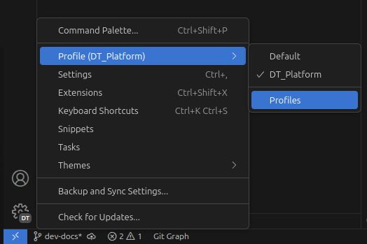
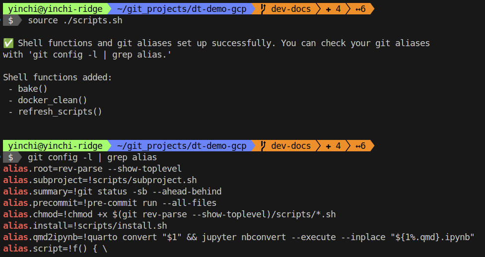
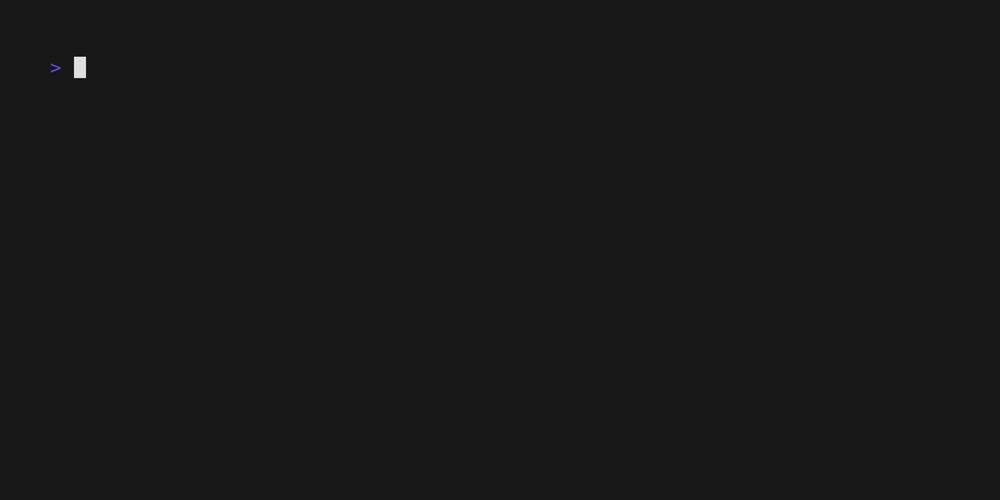

# VS Code environment setup

## Install required packages

1. Append:

   ```bash
   export PATH=$HOME/.local/bin:$PATH
   ```

   to your .bashrc file, then `source ~/.bashrc`.  This ensures newly installed programs can be found.
2. Open VS Code.
3. If you have [installed Pureline](index.md#optional-pureline-setup), you may need to select a Nerd font for your terminal.  Open Settings using `Ctrl+,` and search for `terminal: font family`.
4. Run `./init.sh`.  This will install some packages required for development such as `gum`, `uv`, `yarn`, and `pre-commit`.
    - You may need to run the script multiple times, force-load new environment variables with `. ~/.bashrc`, or even manually install packages to successfully complete the script.

## VS Code development environment

`.vscode/extensions.json` contains a list of recommended VS Code extensions.  Since there are many of these, it may be advisable to install them in a separate profile exclusive to the Hospital DT Demo project.  To do this, click the Settings icon in the bottom left corner of the VS Code window and create a new profile (or select it if already created).



## Scripts

Some scripts can be loaded using `source ./scripts.sh`.  Many of these scripts are written as `git` aliases and can be invoked via `git <command>`, e.g. `git precommit`.



Additionally, scripts in the `scripts/` folder can be run via `git script <command>`.  Use `git script ls` to obtain a list of these scripts.

## Extra programs

Extra programs are available via `git install`.  For example, the Docker option will ensure Docker is installed but also prompt for the installation of the `lazydocker` command-line interface.  It is recommended to install all the programs available via this script.


